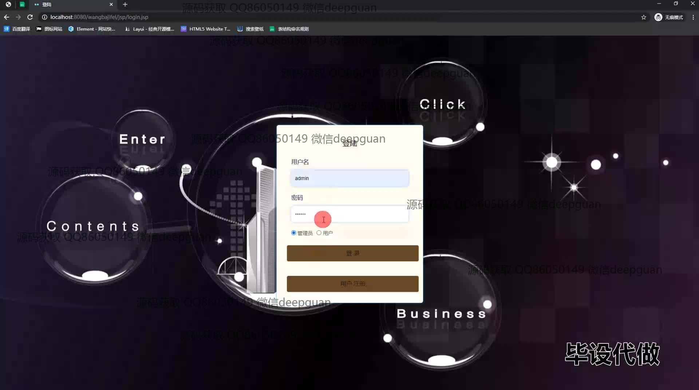
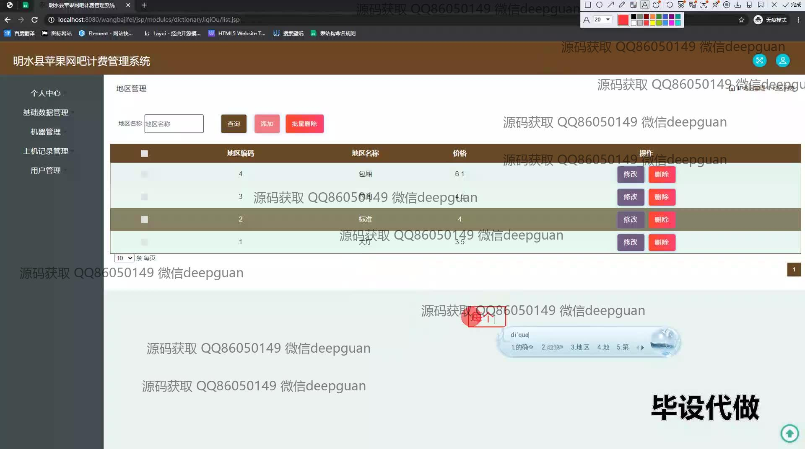
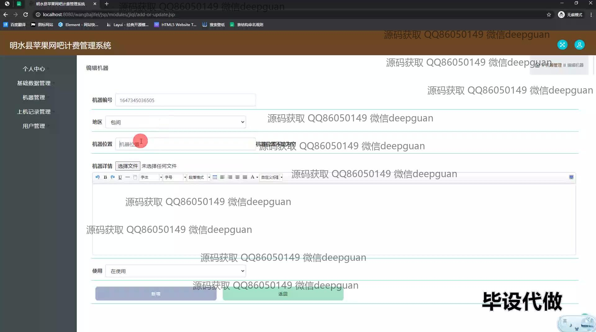
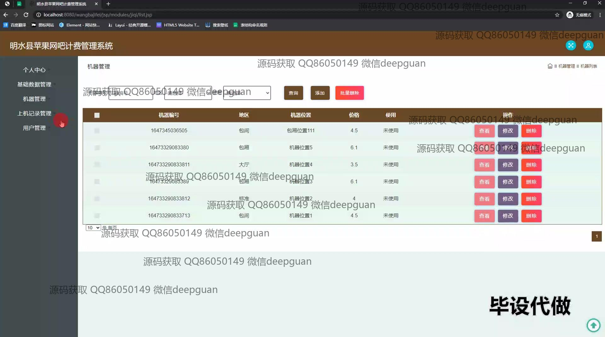
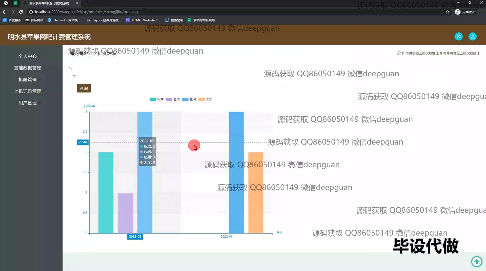
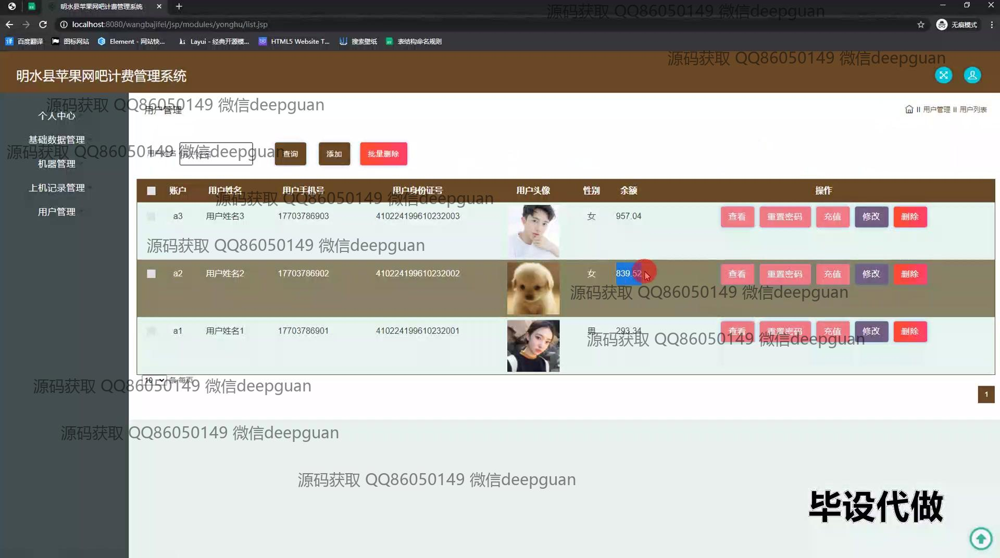
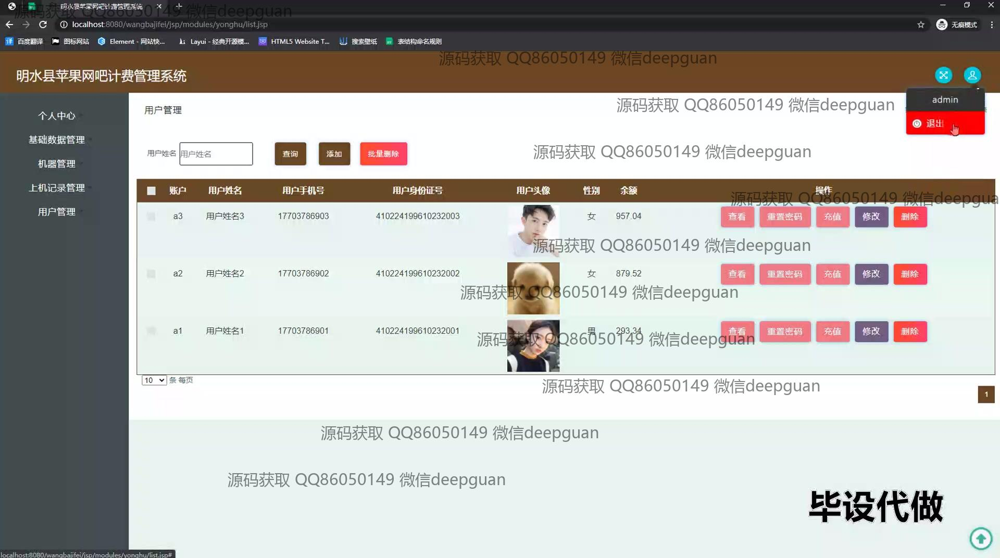
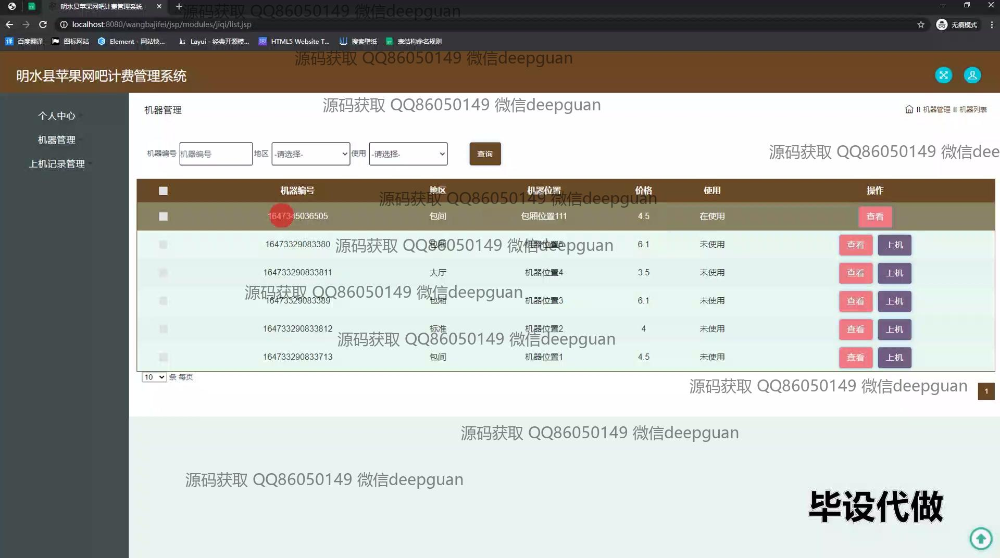
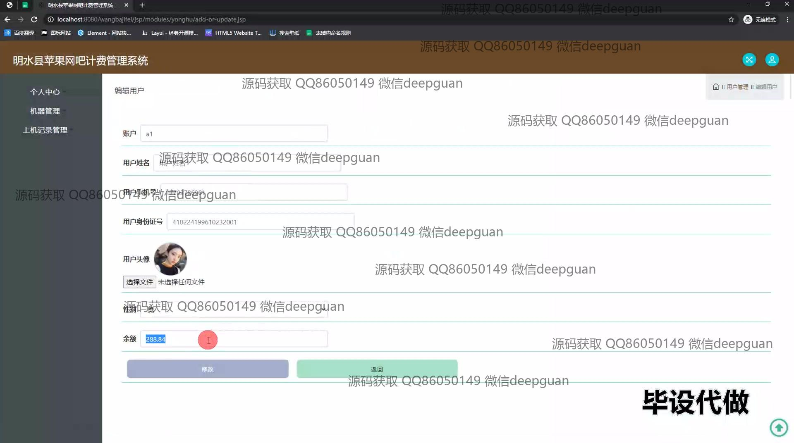
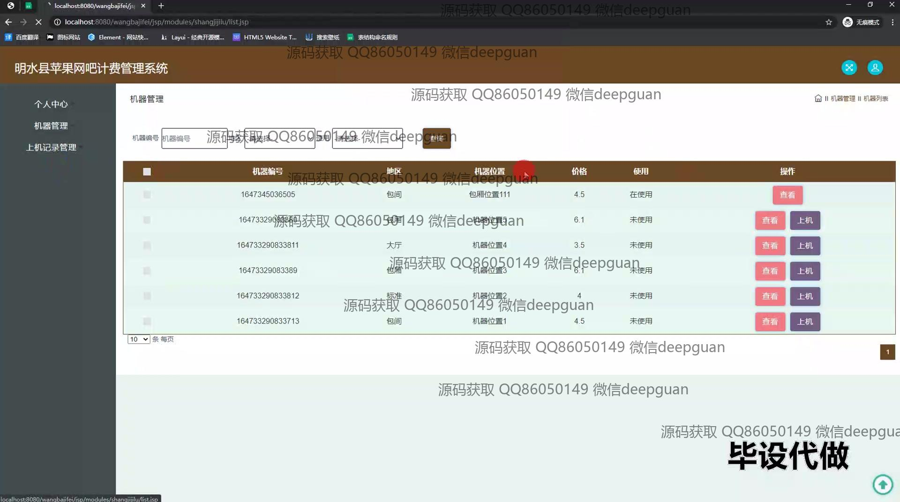

<h1 align="center">基于JSP的明水县苹果网吧计费管理系统的设计与实现+jsp</h1>

## 简介
明水县苹果网吧计费管理系统：角色分为管理员、用户；支持登录界面、计算机信息管理、用户信息编辑、上机记录查看、机器使用监控、区域管理功能。    --计算机毕业设计源码；毕设源码；java毕业设计源码

## 联系方式

<h3 align="center">获取完整代码与数据库文件 + 微信：deepguan QQ: 86050149 QQ群: 783742310</h3>

<h3 align="center">可帮忙远程部署 包运行成功！提供远程部署、修改代码、设计文档指导、代码讲解等服务！</h3>

## 功能介绍（完整见运行截图）
管理员：管理员负责管理和操作整个网吧计费系统，包括登录和注册账户、管理用户信息、维护和检查机器状态、查看和编辑收费数据、以及管理上机记录。管理员可以通过系统进行用户的添加、修改、充值和删除操作。管理员还能够查看每月的上机数据统计，通过数据分析和图表来进行管理决策。除此之外，管理员还可以通过系统的搜索和筛选功能快速查找机器或用户的信息，以提高管理效率。

用户：用户可以通过登录界面进入网吧计费系统，进行账户管理和余额查看。用户还可以编辑个人信息，修改头像、手机号等，同时查看和管理自己的上机记录。在机器使用方面，用户可以查看网吧机器的详细信息，包括机器编号、位置和状态，并可以通过系统进行上机操作。个人中心为用户提供了一个集中的管理空间，使用户能够方便地更新个人资料和查看历史记录。

## 运行截图

本代码来源于网络,仅供学习参考使用!

